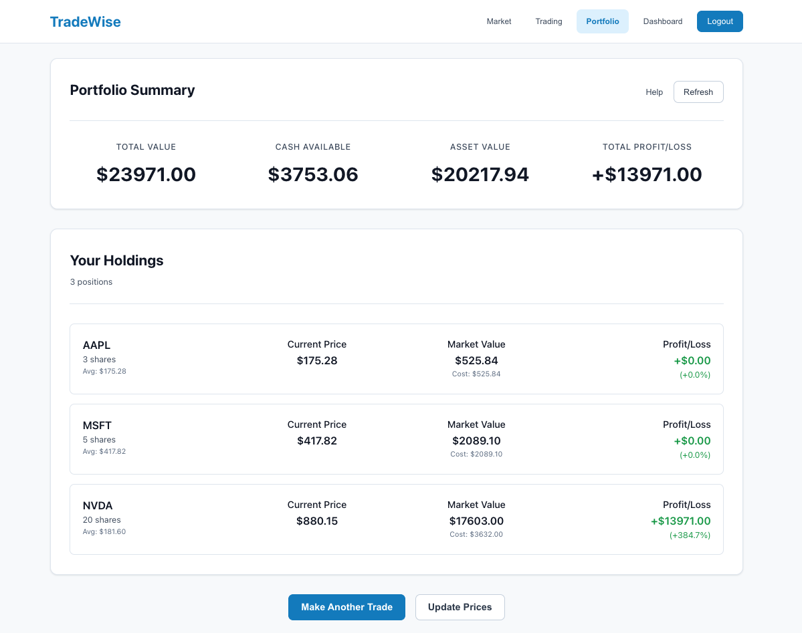

# TradeWise - Stock Trading Platform

A microservices-based trading platform designed for risk-averse investors, featuring intelligent portfolio analysis and conservative investment strategies.





## Target Market

High-net-worth female investors seeking data-driven, risk-informed investment decisions with sophisticated portfolio analysis and conservative trading strategies.

## Tech Stack

- Frontend: React, JSX, CSS3
- Backend: Node.js/Express (5 Microservices)
- APIs: Alpha Vantage for real-time market data
- Architecture: Microservices with HTTP communication
- Database: MongoDB
- Deployment: Docker containers, Kubernetes orchestration

## Microservices and Code Examples

1. Authentication
```
// @route   POST /api/auth/logout
// @desc    Logout user (invalidate refresh tokens)
// @access  Private
router.post('/logout', verifyRefreshToken, async (req, res) => {
    try {
        const user = req.user;
        const refreshToken = req.refreshToken;

        user.refreshTokens = user.refreshTokens.filter(tokenObj => tokenObj.token !== refreshToken);
        await user.save()

        res.json({
            success: true,
            message: 'Logged out successfully'
        });

    } catch (error) {
        console.error('Logout error:', error);
        res.status(500).json({
            success: false,
            message: 'Server error during logout'
        })
    }
})
```

2. Market
```
// Get single stock price
const getStockPrice = async (symbol) => {
    try {
        symbol = symbol.toUpperCase();
        console.log(`Getting stock price for: ${symbol}`);

        let stockData;

        // Try API first if key is available
        if (API_KEY) {
            try {
                const apiData = await fetchFromAPI(symbol);
                stockData = formatStockData(apiData, symbol);
                console.log(`Successfully fetched ${symbol} from API`);
            } catch (apiError) {
                console.warn(`API fetch failed for ${symbol}, falling back to mock data:`, apiError.message);
                stockData = formatStockData(MOCK_DATA[symbol], symbol);
            }
        } else {
            console.warn('No API key found, using mock data');
            stockData = formatStockData(MOCK_DATA[symbol], symbol);
        }

        if (!stockData) {
            throw new Error('Stock not found');
        }

        return stockData;
    } catch (error) {
        console.error(`Error fetching stock price for ${symbol}:`, error);
        throw error;
    }
};
```

3. Trading
```
// @route   POST /api/trading/execute
// @desc    Execute a trade (BUY or SELL)
// @access  Private
router.post('/execute', async (req, res) => {
    try {
      const { symbol, quantity, action } = req.body;
      const userId = req.userId;
  
      // Basic validation
      if (!symbol || !quantity || !action) {
        return res.status(400).json({
          success: false,
          message: 'Symbol, quantity, and action are required'
        });
      }
  
      // Get current stock price
      const stockData = await getStockPrice(symbol.toUpperCase());
      const currentPrice = parseFloat(stockData.price);
      const total = quantity * currentPrice;
  
      // Get user
      const user = await User.findById(userId);
      if (!user) {
        return res.status(404).json({
          success: false,
          message: 'User not found'
        });
      }
  
      // Portfolio snapshot before trade
      const portfolioSnapshot = {
        cashBefore: user.portfolio.cash,
        totalValueBefore: user.portfolio.totalValue
      };
  
      // Execute trade based on action
      if (action === 'BUY') {
        // Check if user has enough cash
        if (user.portfolio.cash < total) {
          return res.status(400).json({
            success: false,
            message: `Insufficient funds. Need $${total.toFixed(2)}, have $${user.portfolio.cash.toFixed(2)}`
          });
        }
        
        // Execute buy
        user.portfolio.cash -= total;
        user.addHolding(symbol.toUpperCase(), quantity, currentPrice);
```

4. Portfolio
```
// Get current prices for all holdings
        const symbols = user.portfolio.holdings.map(h => h.symbol);
        const currentPrices = await getMultipleStockPrices(symbols);

        // Update holdings with current prices and calculate values
        let totalAssetValue = 0;
        let totalDailyChange = 0;

        const updatedHoldings = user.portfolio.holdings.map(holding => {
            const currentData = currentPrices[holding.symbol];
            const currentPrice = currentData ? parseFloat(currentData.price) : holding.currentPrice;
            const previousClose = currentData ? parseFloat(currentData.previousClose) : holding.currentPrice;
            
            const currentValue = holding.shares * currentPrice;
            const previousValue = holding.shares * previousClose;
            const dailyChange = currentValue - previousValue;
            const profitLoss = currentValue - holding.totalCost;
            const profitLossPercent = (profitLoss / holding.totalCost) * 100;

            totalAssetValue += currentValue;
            totalDailyChange += dailyChange;

            // Update holding's current price
            holding.currentPrice = currentPrice;

```

5. Dashboard
```
const Dashboard = () => {
    const [showHelp, setShowHelp] = useState(false);
    const navigate = useNavigate();
    const [dashboardData, setDashboardData] = useState({
        portfolio: {
            totalValue: 0,
            todaysChange: 0,
            holdings: []
        },
        marketSummary: {}
    });
    const [favorites, setFavorites] = useState([]);
    const [recentTrade, setRecentTrade] = useState(null);

    useEffect(() => {
        const loadDashboardData = async () => {
            try {
                const data = await fetchDashboard();
                setDashboardData(data);
            } catch (error) {
                console.error('Error loading dashboard:', error);
            }
        };
        loadDashboardData();
    }, []);
```
6. React Components
```
// Stock APIs - Now calling your backend
export const searchStock = async (query) => {
  try {
    const response = await api.get('/trading/search', {
      params: { q: query }
    });
    
    // Return the first result for compatibility with existing frontend code
    if (response.data.success && response.data.data.results.length > 0) {
      return response.data.data.results[0];
    } else {
      throw new Error('No stocks found');
    }
  } catch (error) {
    throw new Error(error.response?.data?.message || 'Stock search failed');
  }
};
```
